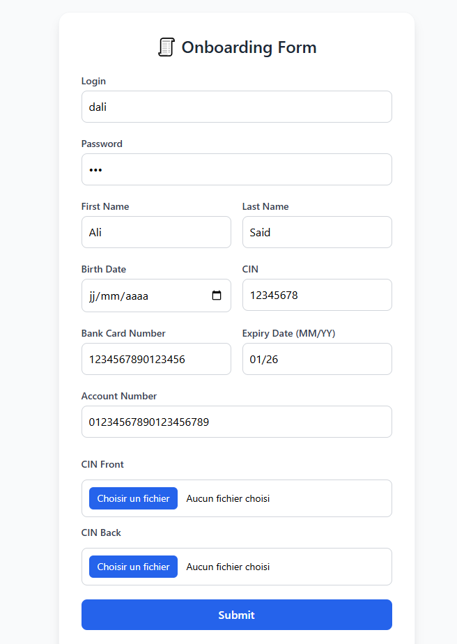
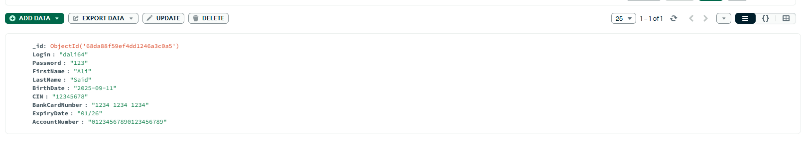

# Alfresco Onboarding

A full‑stack onboarding project integrating **Angular**, **.NET 8 Minimal API**, **MongoDB**, and **Alfresco** for document & metadata management. Clients can submit personal data and upload identification documents (CIN front/back), which are stored in Alfresco and metadata persisted in MongoDB.

---

## 🔹 Features

- Upload **CIN documents** (front/back images).
- Store **client metadata** in MongoDB (Login, Name, CIN, account info, etc.).
- Automatically create a **folder in Alfresco** per client and populate `cm:title`/`cm:description` with client metadata.
- Save files into the newly created Alfresco folder.
- Angular frontend for form submission and file upload.
- .NET 8 Minimal API backend handling uploads, saving metadata to MongoDB, and Alfresco integration.

---

## 🛠 Tech Stack

- **Frontend:** Angular, TypeScript
- **Backend:** .NET 8 Minimal APIs, C#
- **Database:** MongoDB
- **Storage / DMS:** Alfresco Content Services
- **HTTP client:** HttpClient for Alfresco REST API

---

## 📂 Project Structure (suggested)

```
Project-location/
│
├── On-Boarding-app/              # Angular app
│   ├── src/
│   ├── package.json
│   └── ...
│
├── On-Boarding-app-api/              # .NET 8 Web API
│   ├── Program.cs
│   ├── Services/
│   │   └── AlfrescoService.cs
│   │   └── MongoService.cs
│   ├── Models/
│   │   └── Client.cs
│   │   └── ClientFiles.cs
│   └── appsettings.json
│
└── README.md
```

---

## ⚙️ Prerequisites

- .NET 8 SDK
- Node.js + Angular CLI
- MongoDB installed locally (manage with MongoDB Compass) 
- Alfresco instance running in Docker(Community edition https://github.com/Alfresco/acs-deployment/tree/master)

---

## 🧭 Setup Instructions

### 1) Clone the repository

```bash
git clone https://github.com/your-username/alfresco-onboarding-dotnet-8-api.git
cd alfresco-onboarding-dotnet-8-api
```

### 2) Run MongoDB locally

Make sure MongoDB is installed and running locally. You can use MongoDB Compass to connect and manage the database. By default, MongoDB runs on:

```bash
mongodb://localhost:27017
```

No Docker setup is required for MongoDB.


### 3) appsettings.json (server)

Mongo settings and Alfresco config `server/appsettings.json`:

```json
{
  "MongoSettings": {
    "ConnectionString": "mongodb://localhost:27017",
    "DatabaseName": "AppDatabase"
    
  },
  "Alfresco": {
    "BaseUrl": "http://localhost:8080",// nginx proxy handles communicating with alfresco 
    "Username": "admin",
    "Password": "admin",
    "LibraryNodeId":"792295f5-3998-40f4-8179-852f110cb033"
  }
}
```

### 4) MongoService and AlfrescoService in `Program.cs`

Example DI registration (Minimal API):

```csharp
builder.Services.AddHttpClient<AlfrescoService>();
builder.Services.AddSingleton<AlfrescoService>();
builder.Services.AddSingleton<MongoService>();
builder.Services.AddCors(options => options.AddPolicy("AngularClient", policy =>
{ policy.WithOrigins("http://localhost:4200").AllowAnyMethod().AllowAnyHeader(); }));// this is to stop  blocked by CORS policy: No 'Access-Control-Allow-Origin' for developement only
app.UseCors("AngularClient");
```


### 5) Example `MongoService` (using `MongoDB.Driver`) and `AlfrescoService` 

MongoDB:
```csharp
public class MongoService
{
    private readonly IMongoCollection<Client> _collection;
 

    public MongoService(IConfiguration config)
    {
        var client = new MongoClient(config["Mongo:ConnectionString"]);
        var database = client.GetDatabase(config["Mongo:DatabaseName"]);
        _collection = database.GetCollection<Client>("Clients");
    }

    public async Task Save(Client req)
    {
        await _collection.InsertOneAsync(req);
    }
}

```
Alfresco:


```csharp
public async Task<string> CreateFolder(Client folderData) //creates folder inside of library with Cin
    {

        string parentNodeId = _config["Alfresco:LibraryNodeId"] ?? throw new InvalidOperationException("LibraryNodeId not configured");
        var payload = new
        {
            name = folderData.CIN,       // folder name in Alfresco
            nodeType = "cm:folder",
            properties = new Dictionary<string, object>
        {
            { "cm:title", $"{folderData.FirstName} {folderData.LastName}" },
            { "cm:description", $"Client {folderData.FirstName} {folderData.LastName}, CIN: {folderData.CIN}" }
        }

        };

        var response = await _http.PostAsJsonAsync(
            $"alfresco/api/-default-/public/alfresco/versions/1/nodes/{parentNodeId}/children",
            payload);

        response.EnsureSuccessStatusCode();
        var json = await response.Content.ReadFromJsonAsync<JsonElement>();
        return json.GetProperty("entry").GetProperty("id").GetString()!;// return id of folder created to use in uploadfile
    }

```
How it looks like side:







### 6) Minimal API handler (save data to MongoDB API and create Alfresco folder, upload files and metadata API)

```csharp
// RESt api that handles saving into mongodb
app.MapPost("/onboarding", async (Client data, MongoService mongo) =>
{
    try
    {

        await mongo.Save(data);// Save 

        return Results.Ok(new { message = "Client saved successfully" });
    }
    catch (Exception ex)
    {
        Console.WriteLine("ERROR: " + ex.Message);
        return Results.Problem("Internal Server Error: " + ex.Message);
    }
});
```

```csharp
// alfresco api for file and metadata upload aswell as folder creation with respective information
app.MapPost("/onboarding/files", [Microsoft.AspNetCore.Authorization.AllowAnonymous]
async (HttpRequest request, AlfrescoService alfresco) => // switched here to http request because [fromform] causes anti forgery error
{

    
    // setting up cinfront and cinback in formfiles
    if (!request.HasFormContentType) 
        return Results.BadRequest("Expected multipart/form-data");
    var formFiles = await request.ReadFormAsync();

    //setting up metadata here to be added to the new folder in alfresco
    var metadata = request.Query["metadata"];
 if (string.IsNullOrEmpty(metadata))
        return Results.BadRequest("Metadata is required");

    // Decode and deserialize JSON
    var decodedJson = Uri.UnescapeDataString(metadata!);
    var formData = JsonSerializer.Deserialize<Client>(decodedJson);


    var cinFront = formFiles.Files.GetFile("CinFront");
    var cinBack = formFiles.Files.GetFile("CinBack");

    var cinFolderId = await alfresco.CreateFolder(formData);

    //  Upload files into CIN folder
    if (cinFront != null)
        await alfresco.UploadFile(cinFront, cinFolderId, "CIN_Front.jpg");

    if (cinBack != null)
        await alfresco.UploadFile(cinBack, cinFolderId, "CIN_Back.jpg");

    return Results.Ok(new { message = $"Files uploaded under folder {formData.CIN}" });
}).RequireCors(cors => cors.AllowAnyOrigin().AllowAnyMethod().AllowAnyHeader()); //probably unecessary


```


> Note: `CreateFolder` signature in this repo expects `formData` and will build Alfresco `properties` accordingly (e.g. `cm:title` , `cm:description` and CIN as folder name).

---

## 🔒 Security & Compliance Notes

- This is in no way a production build, it is for developement, learning and testing only
- **Do not store sensitive data in plain text** (passwords, bank card numbers). Use tokenization, vaults, or do **not store** card data at all unless you are PCI-compliant.
- Protect endpoints with proper authentication (JWT/OAuth2) in production.
- Sanitize and validate inputs before saving to DB or sending to Alfresco.


---


## 🧾 License

MIT — feel free to change as needed.

---


